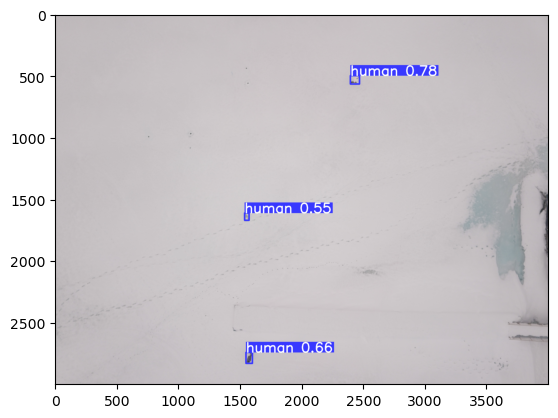
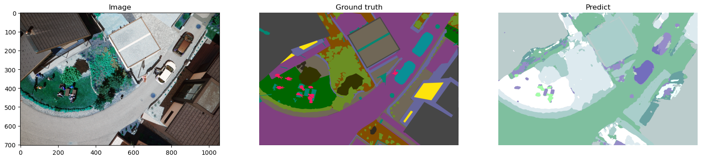
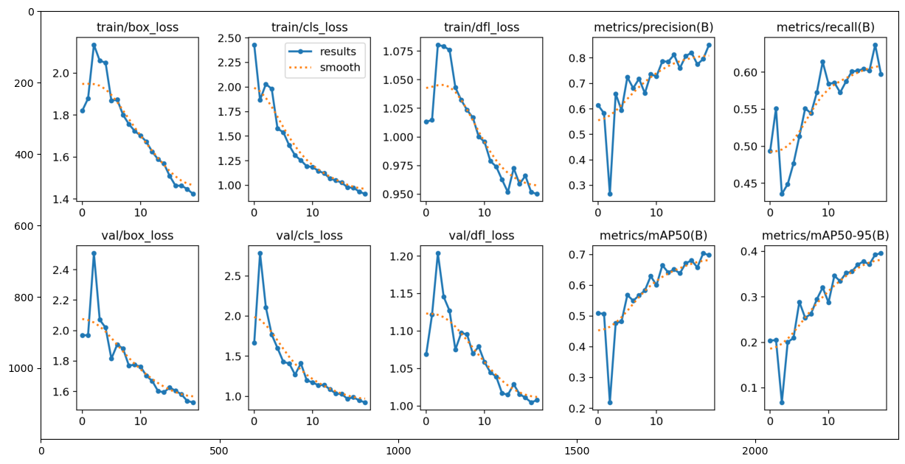
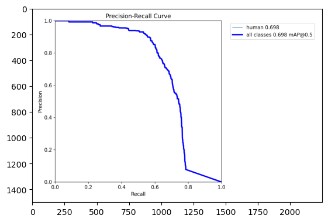
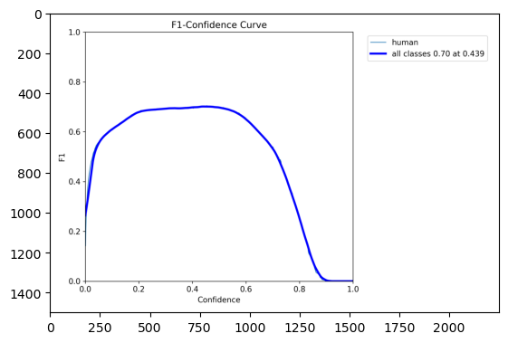

<div align="center">

# 🦉 Strix — Drone Search &amp; Rescue

### Finding missing people from the air with on-board neural detection

<p>


</p>
<p>


</p>

<em>An applied computer-vision research project toward an autonomous drone that detects<br>
missing people in hard-to-reach terrain — in real time, on the aircraft itself.</em>

<br><br>



<sub><b>YOLOv8-nano finding three people from 40–50 m altitude over a low-contrast snow field</b> — confidences 0.78 / 0.55 / 0.66.</sub>

</div>

---

> ### Headline result
> **YOLOv8-nano**, trained on the Lacmus Drone Dataset (LADD), detects people from drone altitude at **mAP@50 = 0.698** and **Precision = 0.852**, running in **8.6 ms/image** with a **6.3 MB** checkpoint — small enough to deploy on a **Jetson Nano** and sweep large search areas autonomously.

Every year thousands of people go missing in forests, mountains and flood plains, where ground search is slow and manpower-limited. A drone carrying an on-board detector can cover in minutes what a search party covers in hours, flagging likely humans for a rescuer to confirm. **Strix** is the full research record of building that detector: the datasets, the two modelling approaches tried, the metrics that decided between them, and the hardware trade-off behind running it on the aircraft.

This README is the complete write-up. Each section links to a deeper chapter in [`docs/`](docs/) and to the original [`notebooks/`](notebooks/).

<div align="center">

**[Motivation](#1-motivation--context) · [Data](#2-data) · [Phase 1: Segmentation](#3-phase-1--semantic-segmentation) · [Phase 2: Detection](#4-phase-2--detection-with-yolov8) · [Hardware](#5-hardware--edge-deployment) · [Results](#6-results--conclusions) · [Repo map](#repository)**

</div>

---

## 1. Motivation &amp; context

Search-and-rescue is a race against hypothermia, dehydration and terrain. The Russian volunteer SAR organisation **LizaAlert** — founded on 15 October 2010 after 5-year-old Liza Fomkina died of hypothermia before volunteers reached her — handled **25,255 requests in 2019 alone**, finding **19,051 people alive** and **2,043 dead**. To help shift that ratio, LizaAlert and the "Owl" group began collecting drone imagery of people, which became the dataset behind this project.

**Project Strix** (named after the scientific genus of true owls — keen-eyed aerial hunters) asks a focused question: *can a small enough neural network detect a person from altitude, in real time, on-board a drone, with no dependence on connectivity?* The system was **presented at TIBO 2023**, the international forum and exhibition in Minsk.

The research ran in three phases, each answering the previous one's failure:

| Phase | Approach | Outcome |
|:--|:--|:--|
| **1 — Segmentation** | Per-pixel person masks (Mask R-CNN → UNet → UNet++ → DeepLabV3+) | Precise in principle, but **noisy at altitude** and **too slow** for real time |
| **2 — Detection** | Instance bounding boxes (YOLOv8, size sweep n/s/m/l) | **Real-time, accurate, deployable** — the winning approach |
| **Hardware** | Four edge boards, energy &amp; flight-time trade-off | **Jetson Nano** — pragmatic choice under budget &amp; SWaP constraints |

📖 *Deep dive: [`docs/00-motivation-and-context.md`](docs/00-motivation-and-context.md)*

---

## 2. Data

Two datasets, one per phase.

**LADD v4.0 — Lacmus Drone Dataset** (primary, detection). Collected by the Lacmus project with LizaAlert and the "Owl" group.

| Property | Value | Property | Value |
|:--|:--|:--|:--|
| Images | 1365 | Resolution | 4000 × 3000 JPEG |
| Classes | 1 — `human` | Annotations | VOC (XML) + YOLO (TXT) |
| Altitude | 40–50 m, horizontal | Seasons | summer · spring · winter |

Split deterministically with `splitfolders` (`seed=42`, ratio 80/10/10) → **1092 train / 136 val / 137 test**; the validation set holds **606 person instances**.

**Semantic Drone Dataset (TU Graz)** (Phase 1 only): 400 images at 6000 × 4000, 23 classes + `conflicting`, with `person` as class 15. Tiny for 23-class segmentation — which is why Phase 1 leaned heavily on augmentation.

📖 *Deep dive: [`docs/01-data.md`](docs/01-data.md) · Prep pipeline: [`notebooks/01-ladd-data-preparation.ipynb`](notebooks/01-ladd-data-preparation.ipynb)*

---

## 3. Phase 1 — Semantic segmentation

**Hypothesis:** per-pixel masks give the most precise localisation of tiny aerial targets.

Built on **PyTorch Lightning** with `segmentation_models_pytorch`, torchmetrics (Accuracy, IoU/Jaccard, F-beta) and a custom **weather-augmentation pipeline** (rain / snow / fog / sun / defocus / dropout) written specifically to stretch the 400-image dataset. Four architectures were tried in sequence:

| Model | Backbone | mean IoU | person IoU | Params | Notes |
|:--|:--|:--:|:--:|:--:|:--|
| Mask R-CNN | R50-FPN | 0.54 | 0.31 | ~44 M | Heavy, ~5 FPS on P100; noisy at altitude |
| UNet | resnet34 | 0.52 | 0.27 | ~24 M | Fast; weak on tiny people |
| UNet++ | resnet34 | 0.56 | 0.31 | ~26 M | Nested skips help edges; still noisy |
| **DeepLabV3+** | resnet34 | **0.58** | **0.34** | ~22 M | Best; ASPP gives global context; **val acc 0.85** |

<div align="center">

<br><sub><b>Image · Ground truth · Prediction.</b> Large regions are captured, but the mask is visibly noisy on small/thin classes — exactly the people we care about.</sub>
</div>

**The two walls that ended the phase:**
1. **Altitude noise** — as the drone climbs, a person shrinks below ~10 px and mask IoU collapses (person IoU 0.34 quantifies it).
2. **Latency &amp; energy** — dense 704 × 1056 prediction is too slow and power-hungry for real-time coverage of large areas on an edge board.

Both point the same way: drop per-pixel masks, switch to **detection**.

📖 *Deep dive: [`docs/02-phase1-segmentation.md`](docs/02-phase1-segmentation.md)*

---

## 4. Phase 2 — Detection with YOLOv8

Bounding boxes are far cheaper than masks, more robust in the tiny-object regime, and fast enough for edge hardware. For SAR, *"a human is in this frame, here"* is exactly the actionable output.

**Setup:** Ultralytics YOLOv8 v8.0.124, single class (`nc:1`), input **1280 px**, SGD (`lr0 0.0195`, `momentum 0.957`, `wd 0.0005`), `close_mosaic 5`, batch 4, tracked with ClearML + Weights &amp; Biases.

<div align="center">

<br><sub>Losses and validation metrics over 20 epochs. Note the epoch-3 LR-warmup dip and the clean tail once mosaic is disabled.</sub>
</div>

**Final validation** (YOLOv8n, best checkpoint, 136 images / 606 instances):

| Precision | Recall | mAP@50 | mAP@50-95 | Peak F1 |
|:--:|:--:|:--:|:--:|:--:|
| **0.852** | 0.598 | **0.698** | 0.396 | 0.70 @ conf 0.439 |

<div align="center">


</div>

The operating point is **precision-dominated**: few false alarms, at the cost of missing the smallest/occluded people. For SAR that is the right bias — a false alarm costs an analyst a few seconds; a false negative can cost a life, so every flagged frame is escalated to a human.

**Why nano?** A size sweep on the same data and target board:

| Model | Params | Weights | mAP@50 | Inference (P100) | Fits Jetson Nano |
|:--|:--:|:--:|:--:|:--:|:--|
| **YOLOv8n** | **3.01 M** | **6.3 MB** | **0.698** | **8.6 ms** | ✅ comfortably |
| YOLOv8s | 11.1 M | 21.5 MB | 0.712 | ~14 ms | ✅ tight |
| YOLOv8m | 25.9 M | 49.7 MB | 0.717 | ~26 ms | ⚠️ marginal |
| YOLOv8l | 43.7 M | 83.7 MB | 0.719 | ~40 ms | ❌ no |

Only **+2.1 mAP@50 points** for ~14× the parameters and ~5× the latency — not worth it for a low-variance single-class dataset. The nano model and the cheapest capable board were **co-selected**: choosing the smallest sufficient detector is what made on-board deployment affordable. Trained in **1.70 h / 20 epochs**; final model **3,011,043 parameters**.

📖 *Deep dive: [`docs/03-phase2-detection.md`](docs/03-phase2-detection.md) · [`notebooks/03-detection-yolov8.ipynb`](notebooks/03-detection-yolov8.ipynb)*

---

## 5. Hardware &amp; edge deployment

Inference must run **on-board** — telemetry latency, wilderness connectivity dead-zones, and the autonomy loop all rule out offloading. Four boards were evaluated for YOLOv8n:

| Board | AI compute | FPS @640 | FPS @1280 | Power | Mass | 2023 $ | Verdict |
|:--|:--|:--:|:--:|:--:|:--:|:--:|:--|
| **Jetson Nano** | ~0.5 TOPS | ~15–19 | ~3–5 | ~10 W | ~140 g | $149 | **Chosen** |
| Coral Dev Board | 4 TOPS INT8 | ~2.6–4 | fails | ~5 W | ~130 g | ~$140 | Reject (SiLU/CPU fallback) |
| RPi 4 + Intel NCS2 | ~1–4 TOPS | ~5–8 | ~1–2 | ~6.5 W | ~134 g | ~$125 | Reject (slow, EOL) |
| Jetson Xavier NX | 21 TOPS INT8 | ~45–55 | ~15–20 | ~15 W | ~170 g | ~$399 | Throughput winner |

A flight-time model (5000 mAh 4S, 1500 g airframe, momentum-theory hover scaling) shows **every board costs only 13–18% of endurance — a spread of ~31 seconds**. Endurance is a weak lever; the real axis is throughput at the resolution the mission needs.

**The honest verdict:** the **Jetson Nano** was the right *pragmatic* choice for a volunteer, budget-bound 2023 build — cheapest, maturest CUDA/TensorRT stack, and a perfect fit for the 6.3 MB nano model, sustaining ~15 FPS at 640 px. The analysis also names the *performance* choice — the **Xavier NX**, the only board holding real-time at 1280 px (which small-object detection from altitude really wants) — for a sub-minute endurance cost. A 2026 rebuild would move to the **Jetson Orin Nano Super**.

📖 *Deep dive: [`docs/04-hardware-and-edge.md`](docs/04-hardware-and-edge.md) · Full board report: [`docs/superpowers/research/hardware-deep-research-report.md`](docs/superpowers/research/hardware-deep-research-report.md)*

---

## 6. Results &amp; conclusions

| Phase | Model | Key metrics |
|:--|:--|:--|
| Phase 1 — Segmentation | DeepLabV3+ (resnet34) | pixel acc **0.85** · mean IoU 0.58 · person IoU 0.34 |
| Phase 2 — Detection | **YOLOv8n** | mAP@50 **0.698** · Precision **0.852** · Recall 0.598 |

**What worked:** detection over segmentation for tiny aerial targets; the nano model over larger variants (low data variance); heavy augmentation to stretch small datasets; deterministic seeded splits for reproducibility; co-selecting the smallest sufficient model with the cheapest capable board.

**Limitations &amp; future work:** recall of 0.598 misses the smallest/occluded people — addressable with higher-resolution tiling (SAHI), a P2 detection head, or thermal/IR fusion for low-visibility conditions; on-board multi-frame tracking; retraining on the Jetson Orin Nano successor; and expanding LADD across more seasons and altitudes.

📖 *Deep dive: [`docs/05-results-and-conclusions.md`](docs/05-results-and-conclusions.md)*

---

## Repository

```
strix-drone-rescue/
├── README.md                       ← you are here (full write-up)
├── docs/
│   ├── 00-motivation-and-context.md
│   ├── 01-data.md
│   ├── 02-phase1-segmentation.md
│   ├── 03-phase2-detection.md
│   ├── 04-hardware-and-edge.md
│   ├── 05-results-and-conclusions.md
│   ├── figures/                    ← recovered training curves & sample detections
│   └── superpowers/research/       ← hardware deep-research prompt + report
├── notebooks/
│   ├── 01-ladd-data-preparation.ipynb
│   ├── 02-semantic-segmentation.ipynb
│   ├── 03-detection-yolov8.ipynb
│   └── 04-system-pipeline.ipynb
└── data/README.md                  ← how to obtain & prepare the datasets
```

**Tech stack:** PyTorch Lightning · `segmentation_models_pytorch` · Ultralytics YOLOv8 · albumentations · torchmetrics · ClearML · Weights &amp; Biases · TensorRT (edge) · NVIDIA Jetson.

<div align="center">
<br>
<sub>Presented at <b>TIBO 2023</b>, Minsk · Built for volunteer search-and-rescue.</sub>
</div>
