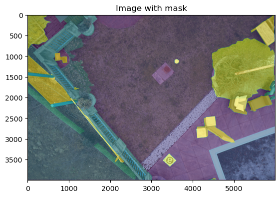

# 01 — Data

## Overview

Strix operates across two distinct phases with different objectives, so a single dataset could not serve both. Phase 1 builds a scene-understanding prototype that needs to parse a full urban environment into many semantic classes; it uses the publicly available **Semantic Drone Dataset** (TU Graz, 23 classes). Phase 2 narrows focus to the single mission-critical task — detecting people from a flying drone — and switches to **LADD v4.0**, a purpose-built aerial human-detection corpus collected under field conditions matching actual search-and-rescue (SAR) deployments.

---

## LADD v4.0 (Lacmus Drone Dataset)

LADD was assembled by the [Lacmus](https://github.com/lacmus-foundation/lacmus) open-source project in cooperation with the LizaAlert SAR volunteer organization and the "Owl" aerial-search group. It represents real mission conditions rather than controlled studio setups.

| Property | Value |
|---|---|
| Total images | 1 365 |
| Classes | 1 (`human`) |
| Drone altitude | 40–50 m (horizontal/nadir shots) |
| Image resolution | 4000 × 3000 px JPEG |
| Annotation formats | Pascal VOC (XML) **and** YOLO (TXT) |
| Seasons covered | Summer · Spring · Winter |


*Figure 1. Example LADD frame (winter, ~45 m altitude). Three subjects are visible against snow; bounding boxes are the VOC-format ground-truth annotations.*

### YOLO Annotation Format

Each `.txt` file contains one row per annotated person. Fields are space-separated and fully normalized to the image dimensions:

```
0  0.4195  0.9696  0.013  0.0213
```

| Token | Meaning |
|---|---|
| `0` | class index (`human` is the only class) |
| `0.4195` | `x_center` — horizontal center, normalized [0, 1] |
| `0.9696` | `y_center` — vertical center, normalized [0, 1] |
| `0.013` | `width` — bounding-box width, normalized [0, 1] |
| `0.0213` | `height` — bounding-box height, normalized [0, 1] |

The small `width` and `height` values (≈1–2 % of frame) reflect real on-screen subject size at 40–50 m altitude — a key source of detection difficulty.

---

## Split Methodology

The dataset was partitioned once, deterministically, using `split-folders`:

```python
splitfolders.ratio(
    input=RAW_DIR,
    output=SPLIT_DIR,
    seed=42,
    ratio=(0.80, 0.10, 0.10),
    move=True,
)
```

| Subset | Images | Notes |
|---|---|---|
| Train | 1092 | 80 % of corpus |
| Validation | 136 | 10 % — **606 person instances** |
| Test | 137 | 10 % — held out until final evaluation |

The fixed `seed=42` makes all downstream experiments fully reproducible: any re-run of the split produces byte-identical subsets. The validation set's 606 annotated person instances serve as the reference population for precision/recall curves throughout Phase 2.

---

## Semantic Drone Dataset (TU Graz)

Used **only in Phase 1** (semantic segmentation prototype). The dataset was released by the Computer Vision Lab at TU Graz.

| Property | Value |
|---|---|
| Total images | 400 |
| Resolution | 6000 × 4000 px |
| Semantic classes | 23 + 1 `conflicting` label |
| `person` class index | 15 |
| `person` RGB colour | (255, 22, 96) |
| Mask encoding | Single-channel index masks (values 0–22) |

Annotations are stored as single-channel PNG masks where each pixel holds an integer class index (0–22). The segmentation model outputs a per-class probability tensor of shape `[B, 23, H, W]`; `argmax` along the class dimension collapses it to an index mask `[B, H, W]`, which a fixed colourmap then converts to an RGB visualization for inspection.



*Figure 2. Example frame from the Semantic Drone Dataset with ground-truth class overlay. Class 15 (`person`, magenta) is among 23 annotated urban categories.*

---

## Data Limitations (Foreshadowing)

**LADD** contains low visual variance: one class, consistent altitude range, and similar background types across frames. This limited variance is the direct reason why the YOLOv8 model-size sweep (nano → s → m → l) in Chapter 03 yields diminishing returns — the task does not reward extra model capacity when the distribution is narrow.

**The Semantic Drone Dataset** is small (400 images distributed across 23 classes, giving sparse per-class coverage). This sparsity is precisely why heavy augmentation — random crops, flips, colour jitter, and elastic distortions — was essential during Phase 1 training, as detailed in Chapter 02.
