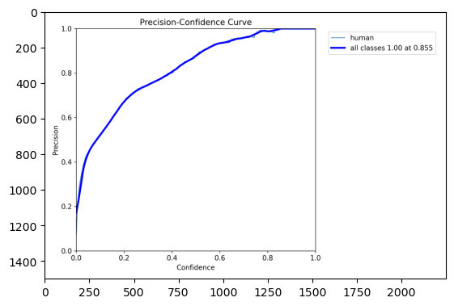
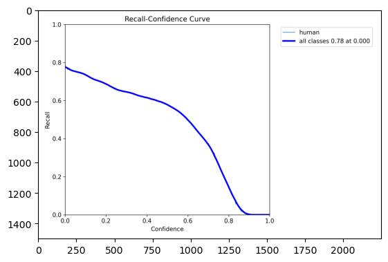
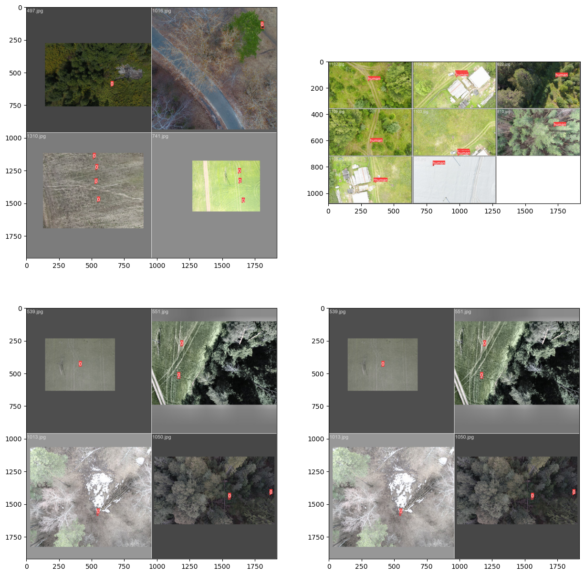

# Phase 2 — Instance Detection with YOLOv8

## The Pivot: From Segmentation to Detection

Phase 1 demonstrated that semantic segmentation can locate people in aerial imagery, but the approach carries a steep operational cost: per-pixel masks require dense prediction heads, large decoders, and memory proportional to image resolution. In the tiny-object regime — a person seen from 40 m altitude can occupy fewer than 100 pixels — the segmentation boundary signal almost vanishes, yet the model must still predict it correctly on every pixel of a 1280×1280 image.

Bounding-box detection sidesteps this. YOLOv8 predicts a compact (x, y, w, h, conf) tuple per object rather than a dense mask, which makes the head dramatically lighter, the loss surface smoother for tiny objects, and inference fast enough to run on constrained edge hardware. For the SAR mission — where the actionable output is "a human is in this frame, at approximately this location" — a tight bounding box is fully sufficient.

---

## Experimental Setup

**Framework.** Ultralytics YOLOv8 v8.0.124, PyTorch 1.13.0, CUDA 11.x.

**Model config.** Single class (`nc: 1`, `names: [human]`), input resolution `imgsz 1280`.

**Optimizer.** SGD with `lr0 0.0195`, `momentum 0.957`, `weight_decay 0.0005`. Training ran for 20 epochs with `patience 3` (early-stopping patience was relaxed to allow full sweep); `close_mosaic 5` disabled mosaic augmentation for the final five epochs to stabilise predictions near convergence. Loss weights: `box 7.5 / cls 0.5 / dfl 1.5`. Batch size 4.

**Experiment tracking.** ClearML (artefact logging) and Weights & Biases (curve streaming) were used in parallel throughout training.

**Augmentation pipeline.**

| Type | Parameters |
|------|-----------|
| HSV jitter | h 0.015 / s 0.7 / v 0.4 |
| Translate | 0.1 |
| Scale | 0.5 |
| Horizontal flip | 0.5 |
| Mosaic | 1.0 (disabled last 5 epochs) |
| Albumentations | Blur, MedianBlur, ToGray, CLAHE — each at p=0.01 |

---

## Training Dynamics

Per-epoch mAP@50 on the validation split across the full 20-epoch run:

| Epoch | mAP@50 | Epoch | mAP@50 |
|-------|--------|-------|--------|
| 1 | 0.509 | 11 | 0.601 |
| 2 | 0.507 | 12 | 0.665 |
| 3 | **0.219** | 13 | 0.642 |
| 4 | 0.477 | 14 | 0.652 |
| 5 | 0.482 | 15 | 0.639 |
| 6 | 0.568 | 16 | 0.672 |
| 7 | 0.550 | 17 | 0.681 |
| 8 | 0.567 | 18 | 0.658 |
| 9 | 0.583 | 19 | **0.704** |
| 10 | 0.630 | 20 | 0.698 |

**Epoch-3 collapse.** mAP@50 dropped sharply to 0.219 before recovering. This is a known LR-warmup instability: the learning-rate schedule briefly pushes weight updates beyond the stable region when gradient momentum has not yet built up, causing the regression head to temporarily produce incoherent boxes. The model self-corrected by epoch 4 (0.477) and showed monotonically increasing trend thereafter with minor oscillation.

**close_mosaic effect.** Around epoch 15, mosaic augmentation was disabled. The final five epochs show reduced variance and a clean upward trend from 0.672 → 0.704, confirming that mosaic was introducing distribution mismatch that hindered convergence at the tail of training.

Best checkpoint: **epoch 19**, mAP@50 = **0.698**.

---

## Final Validation Metrics

Evaluation on 136 validation images containing 606 annotated person instances (best.pt checkpoint):

| Metric | Value |
|--------|-------|
| Precision | **0.852** |
| Recall | **0.598** |
| mAP@50 | **0.698** |
| mAP@50-95 | **0.396** |

### Operating-Point Curves

**Precision–Recall curve** (mAP@0.5 = 0.698):

**F1–Confidence curve** (peak F1 = 0.70 at conf 0.439):

**Precision–Confidence curve** (Precision reaches 1.00 at conf 0.855):

**Recall–Confidence curve** (Recall max = 0.78 at conf 0.0):

**Interpretation.** The operating point is precision-dominated: at the default threshold the model generates very few false alarms (P = 0.852) while missing a meaningful fraction of the smallest or partially occluded individuals (R = 0.598). For the SAR use case this trade-off is operationally appropriate — every flagged frame is escalated to a human reviewer, so a false alarm costs only a few seconds of analyst time, whereas a false negative could cost a life. The system is therefore tuned to flag everything plausible rather than to suppress borderline detections.

---

## Model Size Sweep: Why Nano

The nano backbone was selected after benchmarking the YOLOv8 family on the same dataset and target hardware (NVIDIA Jetson Nano, 4 GB LPDDR4):

| Model | Params | Weights | mAP@50 | mAP@50-95 | P100 inference | Fits Jetson Nano |
|-------|--------|---------|--------|-----------|----------------|------------------|
| YOLOv8n | 3.01 M | 6.3 MB | **0.698** | **0.396** | **8.6 ms** | Yes, comfortably |
| YOLOv8s | 11.1 M | 21.5 MB | 0.712 | 0.410 | ~14 ms | Yes, tight |
| YOLOv8m | 25.9 M | 49.7 MB | 0.717 | 0.415 | ~26 ms | Marginal |
| YOLOv8l | 43.7 M | 83.7 MB | 0.719 | 0.417 | ~40 ms | No (memory/latency) |

The accuracy gap between nano and large is only +2.1 mAP@50 points, yet the parameter count grows ~14× and inference latency ~5×. Given the low inter-class variance of this single-class dataset (all instances are humans viewed from above), the capacity of larger backbones is simply not utilised. YOLOv8n is the only variant that fits the Jetson Nano with comfortable headroom for the rest of the inference pipeline.

Final nano model: **3,011,043 parameters** across 225 layers (fused to 168 layers for inference), exported checkpoint **best.pt at 6.3 MB**.

---

## Qualitative Results

**Winter scene — 3 people detected:**

The model correctly localises all three individuals in a low-contrast snow background. Confidence scores (0.78 / 0.55 / 0.66) reflect the expected distribution: the most visible, upright figure scores highest; partially obscured or prone figures score lower but remain above the operating threshold.

**Training and validation mosaics:**

---

## Cost and Takeaway

| Metric | Value |
|--------|-------|
| Parameters | 3.01 M (3,011,043) |
| Weights (best.pt) | 6.3 MB |
| Inference — Tesla P100 | 8.6 ms / image |
| Training time | 1.70 h (20 epochs) |
| mAP@50 | 0.698 |
| mAP@50-95 | 0.396 |

A model trained in under two hours, weighing 6.3 MB, achieving mAP@50 = 0.698 on a real-world aerial SAR dataset is a competitive result. The combination of high precision (0.852) and real-time throughput (8.6 ms on server-class hardware; comfortably real-time on Jetson Nano after TensorRT export) makes on-board deployment viable without sacrificing detection reliability. Chapter 04 covers the embedded deployment pipeline built on this checkpoint.
